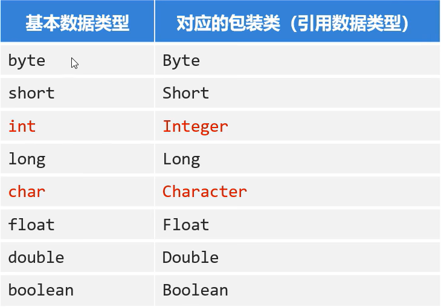

# API
***
## Object类
Object类是Java中所有类的祖宗类，所有类都能用Object类中的方法
### 部分方法
- clone() 创建并返回此对象的副本 **注意：类需要实现Cloneable接口并重写**。由于clone方法由protected修饰，一般需要重写做一个中转才能由main调用。

- equals(Object o) 判断一个对象是否“等于”这个对象 返回ture和false **常用来重写之后制定自己的方法**。

- toString() 返回对象的字符串形式 **常被重写用来sout所需的格式**。

  

  特殊地**objects**由final和static修饰，用来操作对象和检查某些条件

## Objects——工具类

  提供了一系列地静态方法 如equals(Object a，Object b)，isNull(Object o),nonNull(Object o)。

## 包装类

  

  ### Integer 

  - public static String toString(基本数据类型 d) 转成字符串类型

  - public String toString() 

    

  - public static int parseint(String s) 

    parseDouble(String s) 

    把字符串类型数值转换成数值本身对应的数据类型 不建议使用

  - public static integer valueOf(String s) 建议使用

  

***

***

> #### 天才高冷灰姑娘不会遇见虚拟电子人生模拟器

